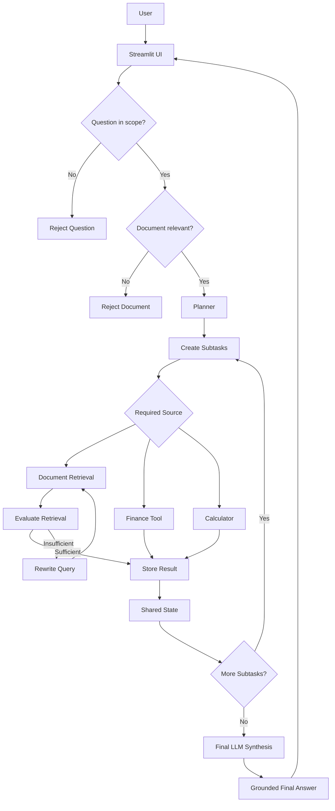

# Simple Agentic RAG

A simple **Agentic RAG (Retrieval-Augmented Generation) proof of
concept** built with **LangChain, Groq, Chroma, Hugging Face embeddings,
and Streamlit**.

The project demonstrates how an LLM can do more than retrieve documents:
it can check whether a question is in scope, plan subtasks, choose
tools, evaluate retrieved information, rewrite a failed retrieval query,
retry retrieval, and synthesize a grounded answer.

> **This is intentionally a simple POC. It does not use LangGraph.**

------------------------------------------------------------------------

## What is Agentic RAG?

### Traditional RAG

A basic RAG system normally follows a mostly fixed pipeline:

``` text
User Question
      ↓
Embed Question
      ↓
Vector Search
      ↓
Retrieve Top-K Chunks
      ↓
LLM
      ↓
Answer
```

The retrieval workflow is largely predetermined.

### This Agentic RAG

This project adds decision-making around the retrieval process:

``` text
                 User
                  │
                  ▼
            Streamlit UI
                  │
                  ▼
            Scope Check
                  │
          ┌───────┴────────┐
          │                │
       Out of scope      In scope
          │                │
          ▼                ▼
        Reject           Planner
                           │
                           ▼
                        Subtasks
                           │
             ┌─────────────┼─────────────┐
             ▼             ▼             ▼
          Documents      Finance      Calculator
             │
             ▼
       Retrieve Evidence
             │
             ▼
      Evaluate Retrieval
             │
        ┌────┴────┐
        │         │
       GOOD      BAD
        │         │
        ▼         ▼
     Continue   Rewrite Query
                  │
                  ▼
              Retrieve Again
                  │
                  ▼
             Shared State
                  │
                  ▼
             Final Synthesis
                  │
                  ▼
                Answer
```

The LLM therefore participates in deciding **what information is needed
and what action should happen next**, rather than simply receiving
retrieved chunks and generating an answer.

------------------------------------------------------------------------

# Features

-   📄 Upload a `.txt` document through the Streamlit UI
-   📚 Use `data/sample.txt` as a default document when no file is
    uploaded
-   🧠 LLM-based question scope checking
-   📝 LLM-based task planning
-   🔎 Semantic document retrieval with Chroma
-   🔄 Retrieval evaluation
-   ✏️ Query rewriting when retrieval is insufficient
-   🔁 Retrieval retry/self-correction
-   💰 Finance lookup tool
-   🧮 Calculator tool
-   🗂️ Shared state between subtasks
-   📝 Final grounded answer synthesis
-   🚫 Reject unsupported questions instead of processing them
    unnecessarily
-   🚫 Reject unrelated uploaded documents
-   🌐 Simple Streamlit web UI

------------------------------------------------------------------------

# Architecture

## 1. User Interface

`app.py` provides the Streamlit interface.

The user can:

1.  Upload a text document.
2.  Ask a question.
3.  Start the Agentic RAG workflow.
4.  See the generated plan.
5.  Inspect execution results.
6.  See the final answer.
7.  Inspect the shared agent state.

------------------------------------------------------------------------

## 2. Document Processing

When a document is uploaded:

``` text
Uploaded TXT
     ↓
Read Text
     ↓
LangChain Document
     ↓
RecursiveCharacterTextSplitter
     ↓
Chunks
     ↓
Hugging Face Embeddings
     ↓
Chroma
```

The current embedding model is:

``` text
sentence-transformers/all-MiniLM-L6-v2
```

The text splitter uses:

``` text
chunk_size = 300
chunk_overlap = 50
```

For this POC, only `.txt` files are supported.

------------------------------------------------------------------------

## 3. Scope Checking

Before expensive agent execution, the system checks whether the question
belongs to the supported domain.

Supported examples include:

-   Questions about the uploaded document
-   Tesla/business questions
-   Business risks
-   Revenue
-   Financial questions
-   Financial comparisons
-   Related calculations

Examples that should be rejected:

``` text
I am not feeling well
How are you?
What is the weather?
Give me relationship advice
Diagnose my symptoms
```

The goal is to prevent the system from behaving like an unrestricted
chatbot.

------------------------------------------------------------------------

## 4. Document Scope Checking

Uploaded documents are also checked before being indexed.

For example:

``` text
requirements.txt
```

should be rejected because it is not a suitable document for the
supported Tesla/business/financial use case.

A relevant document can then be indexed and searched.

------------------------------------------------------------------------

## 5. Planner

`planner.py` creates an execution plan for an in-scope question.

For example:

``` text
Compare Tesla's Q2 2026 revenue with the industry
average and explain which risks could affect revenue.
```

The planner may create subtasks such as:

``` text
1. Retrieve Tesla revenue
2. Retrieve industry average revenue
3. Calculate the difference
4. Retrieve risks from the document
5. Explain how the risks could affect revenue
6. Combine the results
```

It also decides which sources are needed:

``` text
Documents: YES
Finance: YES
Calculator: YES
```

The planner uses normal LLM output parsing rather than Groq
structured-output tooling to keep this POC simple and avoid model/tool
compatibility issues.

------------------------------------------------------------------------

# Tools

The executor has three main tools.

## 1. Document Search

``` text
search_documents
```

Searches the currently loaded Chroma vector store.

It returns retrieved document information to the agentic workflow.

------------------------------------------------------------------------

## 2. Finance Lookup

``` text
finance_lookup
```

Provides structured financial data.

The finance data in this repository is **mock data for demonstration
purposes**.

It must not be interpreted as real Tesla financial data.

------------------------------------------------------------------------

## 3. Calculator

``` text
calculator
```

Performs simple arithmetic such as:

``` text
25000 - 18000
```

or:

``` text
7000 / 18000 * 100
```

------------------------------------------------------------------------

# Agentic Retrieval

One of the main differences from basic RAG is retrieval self-correction.

The workflow is:

``` text
Search
  ↓
Evaluate Retrieved Information
  ↓
Is it sufficient?
  │
  ├── YES → Continue
  │
  └── NO
       ↓
   Rewrite Query
       ↓
   Search Again
       ↓
   Evaluate Again
```

For example, if a generic query produces weak evidence:

``` text
risk
```

the system can rewrite it into a more specific query such as:

``` text
risks affecting Tesla revenue including demand,
competition, supply chain, regulatory changes,
and autonomous driving
```

The goal is not to blindly accept the first retrieval result.

------------------------------------------------------------------------

# Shared State

The executor maintains a simple Python dictionary:

``` python
state = {
    "subtask_results": []
}
```

Each completed subtask is added to this state.

This allows later subtasks and the final synthesis step to use
information produced earlier in the workflow.

This is deliberately implemented with normal Python state rather than
introducing LangGraph.

------------------------------------------------------------------------

# End-to-End Example

A question such as:

``` text
Compare Tesla's Q2 2026 revenue with the industry
average and explain which risks in the document could
affect Tesla's revenue.
```

can follow this process:

``` text
User Question
      ↓
Scope Check
      ↓
Planner
      ↓
┌───────────────────────────────┐
│ Subtask 1                     │
│ Tesla revenue → Finance Tool  │
└───────────────────────────────┘
      ↓
┌───────────────────────────────┐
│ Subtask 2                     │
│ Industry revenue → Finance    │
└───────────────────────────────┘
      ↓
┌───────────────────────────────┐
│ Subtask 3                     │
│ Difference → Calculator       │
└───────────────────────────────┘
      ↓
┌───────────────────────────────┐
│ Subtask 4                     │
│ Risks → Document Retrieval    │
└───────────────────────────────┘
      ↓
Evaluate Retrieval
      ↓
Rewrite + Retry if necessary
      ↓
Shared State
      ↓
Final LLM Synthesis
      ↓
Answer
```

------------------------------------------------------------------------

# Project Structure

``` text
agentic-rag/
│
├── data/
│   └── sample.txt
│
├── chroma_db/
│
├── .streamlit/
│   └── config.toml
│
├── .env
├── .gitignore
├── README.md
├── requirements.txt
│
├── app.py
├── executor.py
├── finance.py
├── planner.py
├── rag.py
└── agent.py
```

### File responsibilities

  -----------------------------------------------------------------------
  File                                Purpose
  ----------------------------------- -----------------------------------
  `app.py`                            Streamlit UI and user interaction

  `rag.py`                            Document loading, chunking,
                                      embeddings, Chroma, retrieval

  `planner.py`                        Scope checking and task planning

  `executor.py`                       Agent execution, tools, retrieval
                                      evaluation, query rewriting,
                                      synthesis

  `finance.py`                        Mock financial lookup tool

  `agent.py`                          Earlier/standalone agent
                                      implementation; the current
                                      Streamlit workflow uses
                                      `executor.py`

  `data/sample.txt`                   Default example knowledge source

  `.env`                              Local API key configuration

  `requirements.txt`                  Python dependencies

  `.streamlit/config.toml`            Optional Streamlit configuration
                                      used to disable the file watcher if
                                      required
  -----------------------------------------------------------------------

------------------------------------------------------------------------


# Architecture Diagram

The complete workflow can be visualized as follows:



### Component-level architecture

```text
┌──────────────────────────────────────────────────────────┐
│                     STREAMLIT UI                         │
│                                                          │
│  Upload Document  ────────────────  Ask Question         │
└───────────────────────┬──────────────────────┬───────────┘
                        │                      │
                        ▼                      ▼
              ┌─────────────────┐    ┌─────────────────┐
              │ Document Scope  │    │ Question Scope  │
              │     Check       │    │      Check      │
              └────────┬────────┘    └────────┬────────┘
                       │                      │
                       └──────────┬───────────┘
                                  ▼
                         ┌─────────────────┐
                         │     PLANNER     │
                         │                 │
                         │ Break question  │
                         │ into subtasks   │
                         └────────┬────────┘
                                  │
                    ┌─────────────┼─────────────┐
                    │             │             │
                    ▼             ▼             ▼
             ┌────────────┐ ┌────────────┐ ┌────────────┐
             │  Chroma /  │ │  Finance   │ │ Calculator │
             │ Documents  │ │    Tool    │ │    Tool    │
             └─────┬──────┘ └──────┬─────┘ └──────┬─────┘
                   │               │              │
                   ▼               │              │
             ┌────────────┐        │              │
             │ Retrieval  │        │              │
             │ Evaluation │        │              │
             └─────┬──────┘        │              │
                   │               │              │
             ┌─────┴─────┐         │              │
             │           │         │              │
          Sufficient  Insufficient │              │
             │           │         │              │
             │           ▼         │              │
             │      Query Rewrite  │              │
             │           │         │              │
             │           └──►──────┘              │
             │                                    │
             └────────────────┬───────────────────┘
                              ▼
                     ┌─────────────────┐
                     │  SHARED STATE   │
                     │                 │
                     │ Subtask results │
                     └────────┬────────┘
                              ▼
                     ┌─────────────────┐
                     │ FINAL SYNTHESIS │
                     │       LLM       │
                     └────────┬────────┘
                              ▼
                     ┌─────────────────┐
                     │ Grounded Answer │
                     └─────────────────┘
```

The **Mermaid diagram** above is the main architecture diagram and is rendered directly by GitHub. The ASCII diagram provides a quick view of the same workflow in environments where Mermaid is not rendered.


# Run Locally

## 1. Clone the repository

``` bash
git clone https://github.com/kavinila05/Agentic-rag.git
cd Agentic-rag
```

## 2. Create a virtual environment

### Windows

``` powershell
python -m venv .venv
.venv\Scripts\Activate.ps1
```

### macOS/Linux

``` bash
python -m venv .venv
source .venv/bin/activate
```

------------------------------------------------------------------------

## 3. Install dependencies

``` bash
pip install -r requirements.txt
```

If Streamlit is not included in your local requirements file:

``` bash
pip install streamlit
```

------------------------------------------------------------------------

## 4. Configure the Groq API key

Create a `.env` file in the project root:

``` text
GROQ_API_KEY=your_groq_api_key_here
```

Do **not** commit `.env` to GitHub.

The repository should contain `.gitignore` with `.env` excluded.

------------------------------------------------------------------------

## 5. Run the application

``` bash
python -m streamlit run app.py
```

Open the local Streamlit URL shown in the terminal, normally:

``` text
http://localhost:8501
```

------------------------------------------------------------------------

# Using the Application

## Option 1: Use the default document

Do not upload anything.

The application uses:

``` text
data/sample.txt
```

Try:

``` text
What are the major risks that could affect Tesla's revenue?
```

------------------------------------------------------------------------

## Option 2: Upload your own document

Upload a `.txt` document using the sidebar.

The application:

``` text
Upload
  ↓
Check document relevance
  ↓
Split into chunks
  ↓
Create embeddings
  ↓
Store in Chroma
  ↓
Ready for retrieval
```

Then ask a question about the document.

For example:

``` text
What are the main risks described in this document?
```

------------------------------------------------------------------------

# Example Questions

### Document retrieval

``` text
What are the major risks facing Tesla?
```

### Revenue-related reasoning

``` text
Which risks could affect Tesla's revenue?
```

### Finance + calculation + RAG

``` text
Compare Tesla's Q2 2026 revenue with the industry
average and explain the risks that could affect revenue.
```

### Out-of-scope handling

``` text
I am not feeling well
```

Expected behavior:

``` text
This question is outside the supported scope.
```

The system should not start asking for medical symptoms or personal
information.

------------------------------------------------------------------------

# Important: Mock Financial Data

The finance tool uses demonstration data.

For example, values such as Tesla Q2 2026 revenue in the application are
**mock values created for this POC**.

They are not intended to represent actual financial filings or
real-world financial information.

------------------------------------------------------------------------

# Why This Is Agentic RAG

The project is not just:

``` text
Question → Vector Search → LLM
```

The LLM participates in decision-making.

It can:

``` text
1. Check whether the question is supported
2. Create a plan
3. Determine required sources
4. Use document retrieval
5. Use financial data
6. Use the calculator
7. Evaluate retrieval
8. Rewrite a weak retrieval query
9. Retry retrieval
10. Combine intermediate results
11. Produce the final grounded answer
```

The important concept is:

> **The LLM is being used as a decision-maker around the RAG pipeline,
> not only as the final answer generator.**

------------------------------------------------------------------------

# Traditional RAG vs Agentic RAG

  -----------------------------------------------------------------------
  Traditional RAG                     This Project
  ----------------------------------- -----------------------------------
  Fixed retrieval flow                LLM-assisted planning

  Usually one retrieval step          Retrieval can be retried

  Retrieve top-k chunks               Retrieval is evaluated

  Poor retrieval may remain poor      Query can be rewritten

  Mainly document retrieval           Documents + finance + calculator

  Direct question → context → answer  Question → plan → tools → state →
                                      answer

  No explicit task planning           Subtask planning

  No retrieval correction             Self-correcting retrieval
  -----------------------------------------------------------------------

------------------------------------------------------------------------

# Technology Stack

-   **Python**
-   **LangChain**
-   **Groq**
-   **Chroma**
-   **Hugging Face Sentence Transformers**
-   **Streamlit**
-   **Pydantic**
-   **python-dotenv**

------------------------------------------------------------------------

# Design Choices

## Why LangChain?

LangChain provides the agent and tool abstractions used in the project.

## Why Chroma?

Chroma provides a lightweight local vector store suitable for a simple
RAG POC.

## Why Hugging Face embeddings?

`all-MiniLM-L6-v2` provides a lightweight local embedding model suitable
for a small demonstration.

## Why Groq?

Groq provides the LLM used for planning, evaluation, query rewriting,
tool-using execution, and final synthesis.

## Why Streamlit?

Streamlit provides a simple UI without requiring a separate frontend
application.

## Why no LangGraph?

This project is intentionally designed as a small learning/portfolio
POC.

The workflow is implemented using LangChain plus ordinary Python control
flow and shared state. LangGraph is therefore not required for this
version.

------------------------------------------------------------------------

# Limitations

This is a **proof of concept**, not a production RAG system.

Current limitations include:

-   Only `.txt` uploads are supported.
-   The vector store is local.
-   The document scope check is LLM-based.
-   Retrieval routing contains some deterministic logic.
-   Financial data is mock data.
-   There is no authentication.
-   There is no production observability.
-   There is no evaluation benchmark.
-   There is no persistent multi-user document management.
-   The agent does not have unrestricted autonomous planning.
-   Error handling and rate-limit handling are intentionally
    lightweight.

These limitations are intentional so that the core Agentic RAG concepts
remain easy to understand.

------------------------------------------------------------------------

